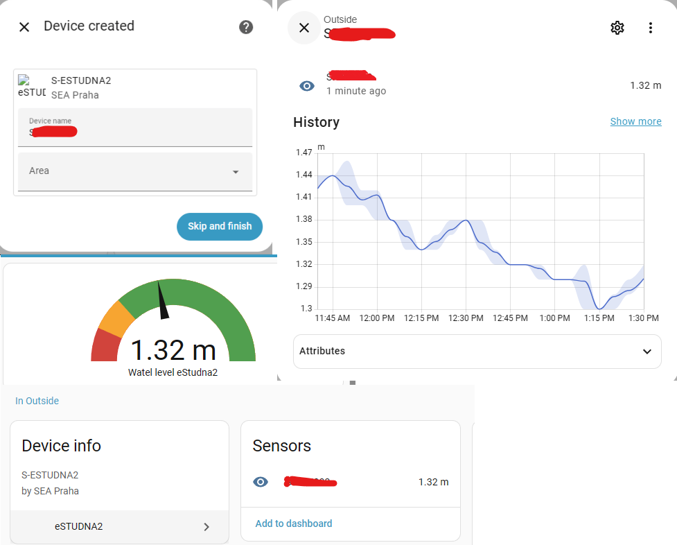

# hass-estudna2
this is for new generation of estudna2 product page here https://www.seapraha.cz/produkt/estudna2/

this intergation is heavily based on https://github.com/nijel/hass-estudna

# eStudna2 Home Assistant Integration

Integration **eStudna2** for Home Assistant.
